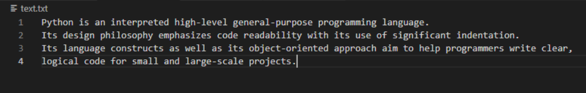

# command-line-arguments-to-count-word
## AIM:
To write a python program for getting the word count from the contents of a file using command line arguments.
## EQUIPEMENT'S REQUIRED: 
PC
Anaconda - Python 3.7
## ALGORITHM: 
### Step 1:
Create a txt file to count the number of word in that file.

### Step 2: 
 Open the txt file in read mode using open().
### Step 3: 
Using split() function to split the words in the txt file and count it.

### Step 4:  
Save the python program using .py extention.

### Step 5: 
Run the python program in terminal to get the output.

### Step 6: 
Number of words in the txt file is displayed as the output.

## PROGRAM:
~~~
count=0
word_search=input("enter the world to be searched")
with open("text.txt",'r') as f:
  for i in f:
    word=i.split()
    for word_find in word:
      if word_find == word_search:
        count+=1
print(word_search,'found',count,'times from the file')
~~~

### OUTPUT:

.png)

## RESULT:
Thus the program is written to find the word count from the contents of a file using command line arguments.
